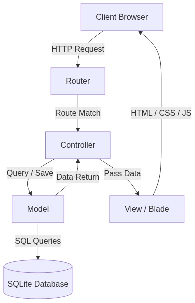
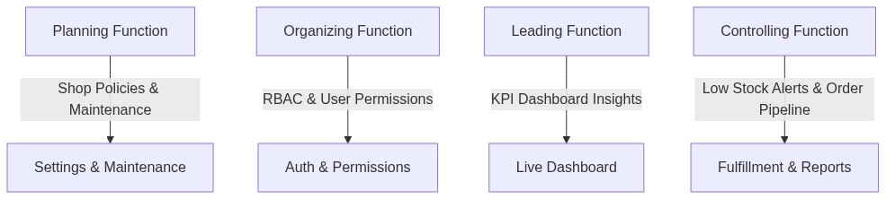
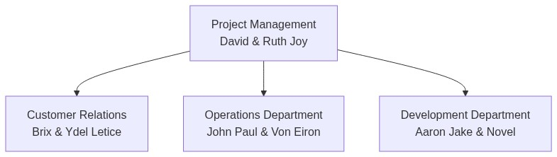

# PureBlooms: An E-Commerce and Operational Management Information System
**A Developed System Soft-Copy Report for Final Academic Requirement**

**Course:** BS in Information Technology (BSIT)  
**Subject:** Organizational Management (OM)  
**Developed System Category:** Software and Information System  
**Submission Date:** June 16, 2026  
**Developed By:** Agile IT Consultancy Team (Group 8)

---

## 📋 Document Metadata & Team Roster

| Student Name | Project Role / Assignment | Organization Department |
| :--- | :--- | :--- |
| David | Narrative Lead & Project Coordinator | Project Management |
| Ruth Joy | OM Integration Analyst & Document Lead | Project Management |
| Brix | Storefront UX Designer & Customer Journey Auditor | Customer Relations |
| Ydel Letice | UI/UX Analyst & Slides Formatting Lead | Customer Relations |
| John Paul | Database Tester & Backend Auditor | Operations Department |
| Von Eiron | Financial & Inventory Audit Lead | Operations Department |
| Aaron Jake | Lead Developer & Repository Maintainer | Development Department |
| Novel | Security Architect & Quality Assurance (QA) | Development Department |

---

## 📌 Executive Summary

PureBlooms is a bespoke, containerized **Software and Information System** designed for a local retail floral business. Small retail gifting shops often operate in a state of organizational disarray, relying on decentralized social media direct messages (DMs), manual ledger entries, and approximate inventory estimation. This operational fragmentation results in lost orders, double-booked stock, and untracked financial transactions, which directly violates the core principles of Organizational Management (OM).

To bridge this operational gap, the Agile IT Consultancy Team developed **PureBlooms**. Built on the Laravel MVC framework, styled with Tailwind CSS, and containerized using Docker, the system operates as a unified operational control panel. For customers, it offers a frictionless, low-cognitive-load web storefront with dynamic add-ons and a live order tracking pipeline. For administrators (sellers), it provides a real-time key performance indicator (KPI) dashboard, order processing pipelines, automated inventory stock alerts, and financial intelligence tools. 

By integrating management theory directly into system features, PureBlooms enforces the four core management functions—**Planning, Organizing, Leading, and Controlling**—transforming chaotic workflows into structured, auditable business processes.

---

## Project Background and Core Business Problem

### Organizational Frame (Agile IT Consultancy Structure)
For the purpose of this project, the development team structured itself as an **Agile IT Consultancy Firm** representing four key organizational departments:
1. **Project Management:** Responsible for coordinating system specifications, aligning project features with OM frameworks, and managing delivery timelines (led by David and Ruth Joy).
2. **Customer Relations:** Focused on customer journey mapping, storefront user experience (UX), and front-end interface quality checks (led by Brix and Ydel Letice).
3. **Operations:** Responsible for seller-side workflows, tracking administrative usability, verifying report calculations, and auditing inventory logic (led by John Paul and Von Eiron).
4. **Development:** Focused on codebase maintenance, Laravel structure, database transaction safety, and non-functional security requirements (led by Aaron Jake and Novel).

### The Client Case Study
The client is a local small-scale florist boutique. Previously, their sales process was entirely decentralized:
* Customers browsed generic images on social media.
* Orders were initiated via chat messages.
* Inventory updates were manual and reactive, leading to situations where items were sold but out of stock.
* Payments were made to a personal GCash number, requiring manual confirmation and manual entry in paper logs.
* Financial reporting was nonexistent, with revenue calculated from memory or chat search history.

### System Classification
In alignment with the final requirement guidelines, the developed system is classified under **Software and Information System**. It is a software application that collects, processes, stores, and distributes information to support decision-making, coordination, and control in a retail flower business.

---

## System Architecture & Technical Design

### Model-View-Controller (MVC) Pattern
The application uses the **Laravel** PHP framework to enforce a strict Model-View-Controller architecture. This decouples business logic, data models, and presentation interfaces:
* **Models (`app/Models/`):** Define the database entities, relations, and business logic (e.g., `Order`, `Product`, `Addon`, `OrderItem`, `Setting`).
* **Views (`resources/views/`):** Built with Laravel Blade templates, rendering dynamic data styled with Tailwind CSS, and structured for accessibility.
* **Controllers (`app/Http/Controllers/`):** Coordinate HTTP requests, validate input data, query models, and return appropriate views or JSON payloads.



### Entity Relationship Diagram (ERD) Outline
The system is built on a clean database schema, designed to prevent data redundancy and maintain referential integrity.

1. **`users` Table:** Stores credential information, contact data, and the `role` field (`admin` vs. `customer`) to enforce access control.
2. **`categories` Table:** Groups products (e.g., Bouquets, Flower Baskets, Single Stems) and tracks active status (`is_active`).
3. **`products` Table:** Tracks product details, price (`decimal:2`), stock quantity (`integer`), and featured status (`is_featured`).
4. **`addons` Table:** Manages optional purchase enhancements (e.g., gift wrappers, custom greeting cards) with corresponding price modifiers.
5. **`orders` Table:** Holds transaction metadata, including order numbers, payment methods, delivery details, status tracking flags, and customer contact information.
6. **`order_items` Table:** Represents the specific line items of an order, capturing the exact price and quantity at the time of purchase to protect historical transaction logs.
7. **`settings` Table:** Key-value registry to govern operational states (e.g., store name, payment rules, maintenance mode status).

---

## System Functionality & Design

This section details the primary software components, modules, and user interfaces designed to support business processes.

### Customer Storefront Module
The storefront provides a consumer-facing, mobile-responsive portal that simplifies the purchasing process.

#### Interactive Storefront Homepage
* **Functionality:** Features a categorized product grid with filtering capabilities. Clear search tools allow users to locate flower categories quickly.
* **UX Design:** Incorporates minimal styling with prominent product images, clear pricing tags, and add-to-cart call-to-actions.
* **Screenshot Placeholder:**
  ```
  [SCREENSHOT PLACEHOLDER: customer_storefront_homepage.png]
  Caption: Customer homepage displaying featured bouquets, category tabs, and header navigation.
  ```

#### Cart & Checkout Workflow
* **Functionality:** The storefront supports a persistent shopping cart alongside a **"Buy Now"** button for direct checkout, skipping the cart process to expedite transactions.
* **Add-on Selection:** Integrates dynamic add-ons (e.g., custom greeting card, premium wrapping) that update the order total in real-time.
* **Payment Support:** Supports Cash on Delivery (COD) and GCash (with dynamic payment references).
* **Screenshot Placeholder:**
  ```
  [SCREENSHOT PLACEHOLDER: customer_checkout_page.png]
  Caption: Checkout screen displaying customer details form, payment method toggles, and dynamic add-on selection.
  ```

#### Order Tracking and Timeline
* **Functionality:** Upon order submission, the customer receives a unique order number. They can enter this number on the tracking page to view a progress timeline.
* **Tracking States:** Renders four distinct phases: `Pending` → `Processing` → `Shipped` → `Delivered`.
* **Screenshot Placeholder:**
  ```
  [SCREENSHOT PLACEHOLDER: customer_order_tracking.png]
  Caption: Customer order tracking page displaying a visual vertical timeline of the order's fulfillment path.
  ```

---

### Operations Center (Admin Panel)
The administrative portal serves as the business's central command center, offering tools to manage operations and monitor performance.

#### Real-Time KPI Dashboard
* **Functionality:** Displays primary key performance indicators (KPIs) immediately upon admin login.
* **Tracked Metrics:** Total Revenue, Total Orders, Pending Orders, Low Stock Alerts, and Add-on Sales.
* **Screenshot Placeholder:**
  ```
  [SCREENSHOT PLACEHOLDER: admin_dashboard.png]
  Caption: Admin Dashboard showing high-level KPIs, metric cards, and low-stock notification alerts.
  ```

#### Order Pipeline Management
* **Functionality:** Provides a central registry of all incoming orders. Administrators can filter orders by status, inspect transaction summaries, and transition orders through fulfillment stages.
* **Order Status Updates:** Changes are logged, updating the customer tracking view and triggering automated updates.
* **Screenshot Placeholder:**
  ```
  [SCREENSHOT PLACEHOLDER: admin_order_pipeline.png]
  Caption: Admin order list interface showcasing filter tabs, action buttons, and status badge indicators.
  ```

#### Sales, Inventory & CRM Reporting
* **Functionality:** The system replaces manual spreadsheets with three dedicated, auto-generated report modules:
  * **Sales Report:** Tracks daily, monthly, and yearly revenue patterns, showing total orders and average order value (AOV).
  * **Inventory Report:** Displays current stock levels, low-stock warnings, and the total financial asset value of items in the warehouse.
  * **Customer Report (CRM):** Identifies repeat buyers, listing purchase frequency and lifetime value (LTV) to support marketing campaigns.
* **Screenshot Placeholder:**
  ```
  [SCREENSHOT PLACEHOLDER: admin_sales_report.png]
  Caption: Admin Sales Report displaying order frequencies and total revenue metrics.
  ```

#### Shop Settings and Maintenance Mode
* **Functionality:** Allows administrators to modify core operating rules, change payment options, update contact information, and upload shop logos.
* **Maintenance Toggle:** Includes a global switch to place the site under a "Maintenance Mode" page during inventory restocks or server updates, preventing incoming orders while preserving admin access.
* **Screenshot Placeholder:**
  ```
  [SCREENSHOT PLACEHOLDER: admin_settings_maintenance.png]
  Caption: System Settings page displaying payment toggles and the global Maintenance Mode switch.
  ```

---

### UI/UX Design Philosophy
* **Cognitive Load Reduction:** Designed to keep layout components spaced and intuitive. Product cards, add-on checkboxes, and form inputs are clean, reducing user friction.
* **HSL Color Harmony:** Uses a soft, warm color palette matching the botanical business category (curated rose pinks, soft sage greens, and neutral backgrounds), avoiding harsh default browser styles.
* **Typography:** Integrates modern, readable sans-serif typography (e.g., Outfit or Inter) loaded from Google Fonts.
* **Responsive Grid Layouts:** Employs CSS Flexbox and Grid layouts to ensure the storefront functions seamlessly on mobile devices, tablets, and desktop displays.

---

## Problem-Solving, Security & Non-Functional Innovations

PureBlooms implements several technical safeguards to address common failure points in transactional software.

### Database Transactions for Data Integrity
* **The Problem:** In standard web setups, if a connection drops or a server errors while writing order details (after deducting stock), the system can drift into an inconsistent state (e.g., stock is reduced, but no order record is saved).
* **The Solution:** The checkout process is wrapped in database transactions (`DB::transaction`). If any database write fails (e.g., saving order metadata, saving order items, or updating product quantities), the system rolls back all writes. Either the entire transaction succeeds, or the database reverts to its original state.

### Server-Side Security Validation (Price Protection)
* **The Problem:** E-commerce systems are sometimes vulnerable to "price hijacking," where a user modifies product prices using the browser's developer inspector tool prior to form submission.
* **The Solution:** PureBlooms ignores product and add-on price parameters sent in client requests. During checkout processing, the system takes the product ID from the client, retrieves the price from the secure database, and calculates the totals server-side.

### Brute-Force Mitigation
* **The Problem:** Attackers may use automated scripts to guess passwords on administrative login screens.
* **The Solution:** Implements rate limiting and throttling via Laravel middleware (`throttle:3,60` on password updates and standard login forms). If a user fails authentication multiple times, the system blocks further attempts from their IP address for a set window.

### Duplicate Order Prevention (Cart Session Tokens)
* **The Problem:** Customers sometimes click the "Submit Order" button multiple times due to slow internet connections, generating duplicate transactions, incorrect inventory deductions, and double-billing.
* **The Solution:** The checkout form generates a unique cart session token. When the checkout request is received, the system verifies and flags this token. If a duplicate request with the same token is sent immediately after, the system filters out the subsequent request.

### Settings Cache & Maintenance Mode Middleware
* **The Problem:** Querying settings from the database on every page load adds unnecessary database queries, slowing response times.
* **The Solution:** App settings are cached. A custom middleware (`App\Http\Middleware\CheckMaintenanceMode`) intercepts all public traffic and redirects visitors to `/maintenance` when maintenance mode is active, while allowing authenticated administrators to navigate the site.

---

## Organizational Management (OM) Integration



### Planning Function
* **Definition:** Defining organizational goals, formulating strategies, and setting policies to coordinate activities.
* **System Mapping:** Managed through the **Settings module**. Administrators can plan store parameters, activate or deactivate payment methods, and toggle Maintenance Mode. This lets management define active operational boundaries and handle transitions (e.g., closing the shop temporarily during holidays or supply chain delays).

### Organizing Function
* **Definition:** Designing administrative structures, assigning tasks, grouping activities, and allocating resources.
* **System Mapping:** Supported by **Role-Based Access Control (RBAC) middleware**. The system enforces two distinct roles: Customers and Admins. Only authenticated administrators have access to inventory management, reporting modules, and settings dashboards. This maps authorization boundaries to personnel roles.

### Leading Function
* **Definition:** Directing, motivating, and influencing stakeholders to achieve organizational objectives using data-driven insights.
* **System Mapping:** Enabled through the **KPI Dashboard**. Managers access real-time metrics on sales performance, order counts, and customer buying patterns. These insights guide marketing campaigns, staffing allocations, and pricing adjustments.

### Controlling Function
* **Definition:** Monitoring performance, comparing it with organizational goals, and taking corrective actions.
* **System Mapping:** Supported by the following components:
  * **Low Stock Alerts:** Automatically flags items falling below defined inventory thresholds, signaling replenishment needs.
  * **Order Pipeline:** Tracks orders as they progress from `Pending` to `Delivered`, identifying delays.
  * **Sales & Inventory Reports:** Evaluates asset values and revenue trends to monitor cost controls.

---

## Team Collaboration and Contribution Log

### Team Organizational Structure
The team divided responsibilities across four distinct functional departments, mirroring a structured IT consultancy organization:



### Individual Contributions Log

The table below outlines the primary contributions of each team member:

| Student Name | Assigned Department | Key Architectural & Documentation Contributions |
| :--- | :--- | :--- |
| David | Project Management | Coordinates team delivery, drafts structural script outlines, configured Docker environments, and integrated user profiles. |
| Ruth Joy | Project Management | Aligns system design with OM theoretical models, designs presentation assets, and writes system documentation. |
| Brix | Customer Relations | Drafts customer journey maps, runs front-end usability audits, and checks the cart module for user friction. |
| Ydel Letice | Customer Relations | Audits the checkout UI, coordinates presentation layouts, and tests storefront responsiveness across mobile devices. |
| John Paul | Operations | Validates order management views, tests SQL constraints, and audits database write behaviors. |
| Von Eiron | Operations | Oversees inventory reporting, verifies financial calculation logic, and reviews CRM reporting tools. |
| Aaron Jake | Development | Serves as Lead Developer. Manages repository operations, oversees the Laravel codebase, and implements MVC architecture. |
| Novel | Development | Functions as Security Architect. Implements rate limiters, verifies database transaction safety, and configures route middleware protections. |

### Collaboration Methodology
The project was executed using Agile software development methodologies:
* **Requirements Gathering:** The Project Management and Customer Relations departments gathered requirements from the florist client.
* **Iterative Sprints:** The Development department implemented features in weekly sprints, prioritizing critical paths (Storefront → Checkout → Admin Control → Reporting).
* **System Auditing:** The Operations department ran tests on reporting logic and database writes to verify accuracy before final integration.
* **Security & QA Reviews:** The Development team audited the system for common vulnerabilities, testing database transaction rollbacks and price tampering guards.

---

## Conclusion

PureBlooms demonstrates how software engineering can address operational challenges in small-scale retail businesses. By replacing manual workflows with structured digital processes, the system establishes a framework that supports the core functions of Organizational Management (OM). 

For the business owner, the platform provides the **control** needed to manage inventory, track order lifecycles, and analyze sales performance. For the customer, it delivers a transparent and user-friendly shopping experience. Through security safeguards, transaction rollbacks, and a containerized environment, PureBlooms offers a robust, production-ready solution that bridges the gap between software development and business operations.
